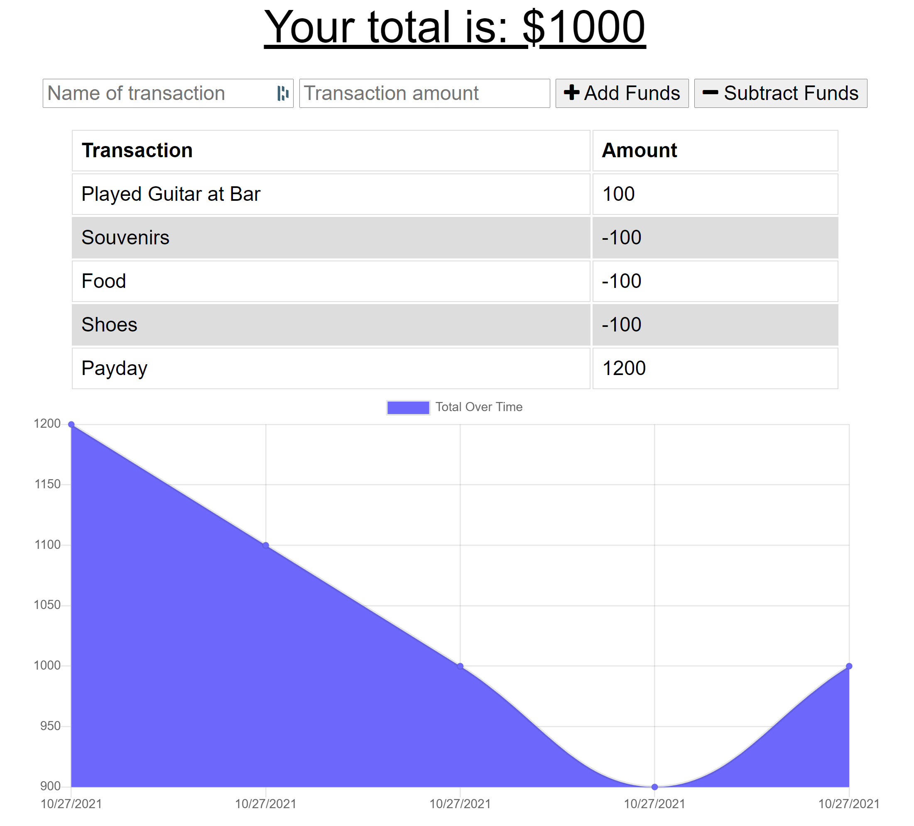

# Budget Tracker Progressive Web Application (PWA) [")](https://opensource.org/licenses/MIT)
  
  ## Description
  This app was created as a tool for users who are traveling abroad or in areas with poor service to allow them to track and their income and expenses regardless of an internet connection. It has full online and offline functionality and automatically syncs transactions that were entered while no connection was available upon a new connection being acquired. 

This was an excellent exercise in creating a progressive web application. The application utilizes a manifest, service-worker, cache-storage for accessing static files, and indexedDB for offline data storage.

Technologies used: 
* Service Workers
* App manifest
* Browser Cache interface API
* IndexedDB

**Click [HERE](https://budget-tracker-progwebapp.herokuapp.com/) to be taken to the deployed application, or by copy/ pasting the below URL into your browser:**
```
https://budget-tracker-progwebapp.herokuapp.com/
```
  
  

  ---
  ## Table of Contents
1. [Installation](#installation)
1. [Usage](#usage)
1. [Contribution](#contribution)
1. [License](#license)
1. [Questions](#questions)

  ---
  
  ## Installation
    
To install this progressive web app, follow the instructions below:

1. Navigate to the deployed application at `https://budget-tracker-progwebapp.herokuapp.com/`

2. In your phone's browser, hit the share button and then select, "add to homescreen".

3. Click "add" or "confirm" depending on your phone. 

4. The app can now be accessed online and offline by clicking the icon on your home screen like any other app.

---

## Usage
    
Your available funds are populated at the top, and right below it there is a simple form for adding transactions. Each transaction is required to include a name, and a transaction amount. Once these fields are filled, you may select either add funds, or subtract funds, depending on whether the transaction in question was an expense or a receipt of funds. 

From there, the transaction will automatically be added to the transaction table, and the chart will be upgraded. 

This process can be done whether an internet connection is available or not. Upon loading the page and a connection being found, the app will automatically sync with the database. 

---

## Contribution
    
Thank you for considering contributing to this project. If you would like to contribute, feel free to fork the repository, add your functionality or bugfix, and submit a pull request. I will review the changes and contact you with any questions or concerns.

---

## License
  
  This application is licensed under **The Massachusets Institute of Technology License (MIT)**.
  
  Click the license badge below for more information and usage guidelines:
  
  [")](https://opensource.org/licenses/MIT)
  
  Click [here](https://www.mit.edu/~amini/LICENSE.md
  "MIT Full Terms and Conditions") to view the full terms and conditions text of MIT.
  
  ---
  
  ## Questions
  
Please do not hesitate to reach out with any questions you may have. I can be reached in the following ways:

* Email: [ElijahARomer@gmail.com](mailto:ElijahARomer@gmail.com)
* GitHub: [ElijahRomer](http://www.github.com/ElijahRomer)


Thank you for reaching out and I look forward to getting in touch with you soon!


